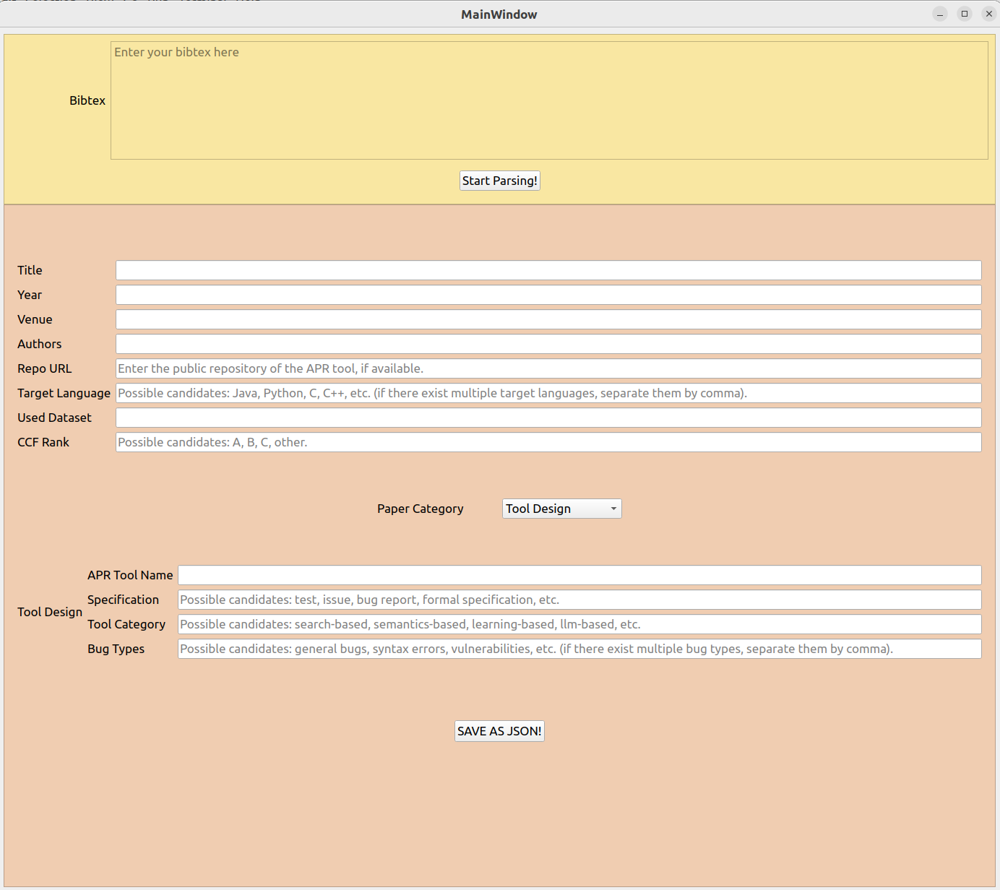

# A Collection of Automated Program Repair (APR) Tools

We have collected a list of APR tools since 2008 in this repository. For each APR tool, we have attached the following metadata:
1. Publication Title
2. Publication Year 
3. Publication Venue
4. Link 
5. Target Language
6. Evaluated Dataset
7. CCF Rank

We hope it could serve as a good reference point for APR researchers who would like to get a complete list of APR tools and newcomers who are interested in APR.

This project is licensed under the [GNU GPLv3 LICENSE](./LICENSE).

## The Way to Contribute to this Repository

To contribute to this repository, you can follow these steps:

### Step 1: Fork the Repository

### Step 2: Configure the Python Environment

1. `cd metadata_manager`
2. `conda env create -f env.yml`
3. `conda activate apr-tools`
4. `python main_json_generator.py`,

and then you will see the following Window:

First, paste the Bibtex data of the paper you want to add, and click "Start Parsing". Then, fill the corresponding fields (e.g., APR tool name, Specification) of the paper in the UI. Finally, click "Save As JSON" to add the paper metadata to the output directory (i.e., `output/json_new`). 

5. `python main_json_parser.py` to update the Markdown Table of the `README.md` file.

### Step 3: Create a PR 

## Update

We will continue updating the repository to include the latest APR tools. Any contribution is very welcomed :blush:!

The Excel version is available [here](./A_collection_of_apr_tools.xlsx).

The Markdown version is as follows:

## APR Tool List (sorted by year)

|     | Title                                                                                                                                        | APR Tool Name                 |   Year | Venue                                                                                              | Repo URL                                                                      | Target Language                       | Used Dataset                                                                                                                                                  | CCF Rank   |
|----:|:---------------------------------------------------------------------------------------------------------------------------------------------|:------------------------------|-------:|:---------------------------------------------------------------------------------------------------|:------------------------------------------------------------------------------|:--------------------------------------|:--------------------------------------------------------------------------------------------------------------------------------------------------------------|:-----------|
|   1 | Template-Guided Program Repair in the Era of Large Language Models                                                                           | NTR                           |   2025 | ICSE                                                                                               | https://sites.google.com/view/neuraltemplaterepair                            | ['Java']                              | ['Defects4J', 'HumanEval-Java']                                                                                                                               | A          |
|   2 | {CREF:} An LLM-Based Conversational Software Repair Framework for Programming Tutors                                                         | Cref                          |   2024 | ISSTA                                                                                              | https://github.com/buaabarty/CREF                                             | ['C++']                               | ['TutorCode (1239 C++ defect codes)']                                                                                                                         | A          |
|   3 | Vision Transformer Inspired Automated Vulnerability Repair                                                                                   | VQM                           |   2024 | TOSEM                                                                                              | https://github.com/awsm-research/VQM                                          | C, C++                                | CVEfixes, Big-Vul                                                                                                                                             | A          |
|   4 | ThinkRepair: Self-Directed Automated Program Repair                                                                                          | ThinkRepair                   |   2024 | ISSTA                                                                                              | https://github.com/vinci-grape/ThinkRepair                                    | ['Java']                              | ['Defects4J', 'QuixBugs']                                                                                                                                     | A          |
|   5 | Template-based Neural Program Repair                                                                                                         | TENURE                        |   2024 | ICSE                                                                                               | https://github.com/mxx1219/TENURE                                             | ['Java']                              | ['Defects4J']                                                                                                                                                 | A          |
|   6 | T5APR: Empowering Automated Program Repair across Languages through Checkpoint Ensemble                                                      | T5APR                         |   2024 | JSS                                                                                                | https://github.com/h4iku/T5APR                                                | ['Java', 'Python', 'C', 'JavaScript'] | ['Defects4J', 'Bears', 'QuixBugs', 'Codeflaws', 'ManyBugs', 'BugAID']                                                                                         | B          |
|   7 | Strider: Signal Value Transition-Guided Defect Repair for {HDL} Programming Assignments                                                      | Strider                       |   2024 | TCAD                                                                                               |                                                                               | ['Verilog']                           | ['']                                                                                                                                                          | A          |
|   8 | SWE-agent: Agent-Computer Interfaces Enable Automated Software Engineering                                                                   | SWE-agent                     |   2024 | arxiv                                                                                              | https://github.com/princeton-nlp/SWE-agent                                    | ['Python']                            | ['SWE-bench']                                                                                                                                                 | other      |
|   9 | Revisiting Evolutionary Program Repair via Code Language Model                                                                               | ARJA-CLM                      |   2024 | arxiv                                                                                              |                                                                               | ['Java']                              | ['Defects4J', '  APR-2024 competition benchmark']                                                                                                             | other      |
|  10 | RTL-Repair: Fast Symbolic Repair of Hardware Design Code                                                                                     | RTL-Repair                    |   2024 | ASPLOS                                                                                             |                                                                               | ['Verilog']                           | ['']                                                                                                                                                          | A          |
|  11 | OpenDevin: An Open Platform for AI Software Developers as Generalist Agents                                                                  | OpenDevin                     |   2024 | arxiv                                                                                              | https://github.com/OpenDevin/OpenDevin                                        | ['Python']                            | ['SWE-bench']                                                                                                                                                 | other      |
|  12 | One Size Does Not Fit All: Multi-granularity Patch Generation for Better Automated Program Repair                                            | Mulpor                        |   2024 | ISSTA                                                                                              | https://zenodo.org/records/12660892                                           | ['Java']                              | ['Defects4J', 'VulRD']                                                                                                                                        | A          |
|  13 | MarsCode Agent: AI-native Automated Bug Fixing                                                                                               | MarsCode                      |   2024 | arxiv                                                                                              | -                                                                             | ['Python']                            | ['SWE-bench']                                                                                                                                                 | other      |
|  14 | MASAI: Modular Architecture for Software-engineering AI Agents                                                                               | MASAI                         |   2024 | NeurIPS                                                                                            | https://github.com/masai-dev-agent/masai                                      | ['Python']                            | ['SWE-bench']                                                                                                                                                 | other      |
|  15 | MAGIS: LLM-Based Multi-Agent Framework for GitHub Issue Resolution                                                                           | MAGIS                         |   2024 | arxiv                                                                                              | -                                                                             | ['Python']                            | ['SWE-bench']                                                                                                                                                 | other      |
|  16 | ITER: Iterative Neural Repair for Multi-Location Patches                                                                                     | ITER                          |   2024 | ICSE                                                                                               | https://github.com/ASSERT-KTH/ITER                                            | ['Java']                              | ['Defects4J']                                                                                                                                                 | A          |
|  17 | How to Understand Whole Software Repository?                                                                                                 | RepoUnderstander              |   2024 | arxiv                                                                                              | https://github.com/RepoUnderstander/RepoUnderstander                          | ['Python']                            | ['SWE-bench']                                                                                                                                                 | other      |
|  18 | How Far Can We Go with Practical Function-Level Program Repair?                                                                              | Srepair                       |   2024 | arxiv                                                                                              | https://github.com/GhabiX/Srepair                                             | ['Java']                              | ['Defects4J']                                                                                                                                                 | other      |
|  19 | Enhancing Automated Program Repair with Solution Design                                                                                      | DRCodePilot                   |   2024 | ASE                                                                                                | https://figshare.com/s/82ed8e86e88d3268b4c1                                   | ['Java']                              | ['Flink', 'Solr']                                                                                                                                             | A          |
|  20 | Enhanced Evolutionary Automated Program Repair by Finer-Granularity Ingredients and Better Search Algorithms                                 | MicroRepair                   |   2024 | Internetware                                                                                       | https://github.com/liuxiu-1997/MicroRepair                                    | ['Java']                              | ['Defects4J']                                                                                                                                                 | C          |
|  21 | DeepCode AI Fix: Fixing Security Vulnerabilities with Large Language Models                                                                  | DeepCode AI Fix               |   2024 | arxiv                                                                                              | https://github.com/snyk/deepcode_ai_fix                                       | ['JavaScript']                        | ['self-constructed dataset from github']                                                                                                                      | other      |
|  22 | CodeR: Issue Resolving with Multi-Agent and Task Graphs                                                                                      | CodeR                         |   2024 | arxiv                                                                                              | https://github.com/NL2Code/CodeR                                              | ['Python']                            | ['SWE-bench']                                                                                                                                                 | other      |
|  23 | Benchmarking and Categorizing the Performance of Neural Program Repair Systems for Java                                                      | NPR4J (Repair Framework)      |   2024 | TOSEM                                                                                              | https://github.com/kwz219/NPR4J                                               | Java                                  | Defects4J, QuixBugs, Bears                                                                                                                                    | A          |
|  24 | Automated Code Editing with Search-Generate-Modify                                                                                           | SARGAM                        |   2024 | arxiv                                                                                              | https://github.com/SarGAMTEAM/SarGAM.git                                      | ['Java', 'Python']                    | ['Defects4J', 'QuixBugs']                                                                                                                                     | Other      |
|  25 | AutoCodeRover: Autonomous Program Improvement                                                                                                | AutoCodeRover                 |   2024 | ISSTA                                                                                              | https://github.com/nus-apr/auto-code-rover                                    | ['Python']                            | ['SWE-bench']                                                                                                                                                 | other      |
|  26 | Agentless: Demystifying LLM-based Software Engineering Agents                                                                                | Agentless                     |   2024 | arxiv                                                                                              | https://github.com/OpenAutoCoder/Agentless                                    | ['Python']                            | ['SWE-bench']                                                                                                                                                 | other      |
|  27 | Tare: Type-aware neural program repair                                                                                                       | Tare                          |   2023 | ICSE                                                                                               | https://doi.org/10.5281/zenodo.7029404                                        | ['Java', 'Python']                    | ['Defects4J', 'QuixBugs']                                                                                                                                     | A          |
|  28 | SeqTrans: Automatic Vulnerability Fix Via Sequence to Sequence Learning                                                                      | SeqTrans                      |   2023 | TSE                                                                                                | https://github.com/chijianlei/SeqTrans                                        | ['Java']                              | ['Tufano’s dataset', ' Ponta’s datasets']                                                                                                                     | A          |
|  29 | RepairLLaMA: Efficient Representations and Fine-Tuned Adapters for Program Repair                                                            | RepairLLaMA                   |   2023 | arxiv                                                                                              | https://github.com/ASSERT-KTH/repairllama                                     | ['Java']                              | ['Defects4J', 'HumanEval-Java']                                                                                                                               | Other      |
|  30 | RAP-Gen: Retrieval-Augmented Patch Generation with CodeT5 for Automatic Program Repair                                                       | Rap-Gen                       |   2023 | FSE                                                                                                | https://figshare.com/s/a4e95baee01bba14bf4b                                   | ['Java', 'JavaScript']                | ['Defects4J', 'TFix', 'Code Refinement']                                                                                                                      | A          |
|  31 | Program Repair with Repeated Learning                                                                                                        | Liana                         |   2023 | TSE                                                                                                | http://www4.comp.polyu.edu.hk/~csypei/download/LIANA-TSE.zip                  | ['Java']                              | ['Defects4J', 'INTROCLASSJAVA', 'QUIXBUGS']                                                                                                                   | A          |
|  32 | Neural Transfer Learning for Repairing Security Vulnerabilities in {C} Code                                                                  | VRepair                       |   2023 | TSE                                                                                                | https://github.com/SteveKommrusch/VRepair                                     | C                                     | Big-Vul, CVE-fixes                                                                                                                                            | A          |
|  33 | Majority Rule: better patching via Self-Consistency                                                                                          | Code-DaVinci-002 with S-C     |   2023 | arxiv                                                                                              | https://doi.org/10.5281/zenodo.7968641                                        | ['Java']                              | ['MODIT dataset']                                                                                                                                             | Other      |
|  34 | MUFIN: Improving Neural Repair Models with Back-Translation                                                                                  | MUFIN                         |   2023 | arxiv                                                                                              | https://github.com/andre15silva/mufin                                         | ['Java']                              | ['Defects4J', 'QuixBugs']                                                                                                                                     | Other      |
|  35 | MCRepair: Multi-Chunk Program Repair via Patch Optimization with Buggy Block                                                                 | MCRepair                      |   2023 | SAC                                                                                                | https://github.com/kimjisung78/MCRepair                                       | ['Java']                              | ['Defects4J']                                                                                                                                                 | Other      |
|  36 | Katana: Dual Slicing-Based Context for Learning Bug Fixes                                                                                    | KATANA                        |   2023 | TOSEM                                                                                              | -                                                                             | ['JavaScript']                        | ['two separate datasets using our single and dual slicing techniques']                                                                                        | A          |
|  37 | KNOD: Domain Knowledge Distilled Tree Decoder for Automated Program Repair                                                                   | KNOD                          |   2023 | ICSE                                                                                               | https://github.com/lin-tan/knod                                               | ['Java', 'Python']                    | ['Defects4J', 'QuixBugs']                                                                                                                                     | A          |
|  38 | Gamma: Revisiting Template-Based Automated Program Repair Via Mask Prediction                                                                | Gamma                         |   2023 | ASE                                                                                                | https://github.com/iSEngLab/GAMMA                                             | ['Java', 'Python']                    | ['Defects4J', 'QuixBugs']                                                                                                                                     | A          |
|  39 | GLAD: Neural Predicate Synthesis to Repair Omission Faults                                                                                   | GLAD                          |   2023 | ICSE-Companion                                                                                     | https://anonymous.4open.science/r/neural-pred-synth-4816/README.md            | ['Java']                              | ['Defects4J']                                                                                                                                                 | A          |
|     |                                                                                                                                              |                               |        | （poster）                                                                                           |                                                                               |                                       |                                                                                                                                                               |            |
|  40 | Explainable Automated Debugging via Large Language Model-driven Scientific Debugging                                                         | AutoSD                        |   2023 | arxiv                                                                                              | -                                                                             | ['Java', 'Python']                    | ['Defects4J', 'BugsInPy']                                                                                                                                     | Other      |
|  41 | Embedding Context as Code Dependencies for Neural Program Repair                                                                             | GLANCE                        |   2023 | ICSR                                                                                               | https://github.com/neural-repair/glance                                       | ['JavaScript']                        | ['top 1100 open-source projects (based on GitHub stars) containing buggy commits from both frontend and backend JavaScript code']                             | C          |
|  42 | Copiloting the Copilots: Fusing Large Language Models with Completion Engines for Automated Program Repair                                   | Repilot                       |   2023 | FSE                                                                                                | https://github.com/ise-uiuc/Repilot                                           | ['Java']                              | ['Defects4J']                                                                                                                                                 | A          |
|  43 | Better Automatic Program Repair by Using Bug Reports and Tests Together                                                                      | SBIR-SimFix                   |   2023 | ICSE                                                                                               | https://github.com/LASER-UMASS/SBIR-ReplicationPackage                        | ['Java']                              | ['Defects4J']                                                                                                                                                 | A          |
|  44 | Automated repair of programs from large language models                                                                                      | CodeX-e                       |   2023 | ICSE                                                                                               | https://github.com/apr4codex/icse2023                                         | ['Java']                              | ['Defects4J']                                                                                                                                                 | A          |
|  45 | Automated Program Repair Based on Code Review: How do Pre-trained Transformer Models Perform?                                                | Fine-tuned CodeT5             |   2023 | arxiv                                                                                              | -                                                                             | ['Java']                              | ['Dataset by Tufano et al', 'Review4Repair Dataset']                                                                                                          | Other      |
|  46 | VulRepair: a T5-based automated software vulnerability repair                                                                                | VulRepair                     |   2022 | FSE                                                                                                | https://github.com/awsm-research/VulRepair                                    | ['C', ' C++']                         | ['CVEFixes dataset']                                                                                                                                          | A          |
|  47 | Verifix: Verified Repair of Programming Assignments                                                                                          | Verifix                       |   2022 | TOSEM                                                                                              | https://github.com/zhiyufan/Verifix/tree/master                               | ['']                                  | ['']                                                                                                                                                          | A          |
|  48 | Trident: Controlling Side Effects in Automated Program Repair                                                                                | Trident                       |   2022 | TSE                                                                                                | https://program-repair.s3-ap-southeast-1.amazonaws.com/trident-submission.zip | ['C']                                 | ['ManyBugs']                                                                                                                                                  | A          |
|  49 | TransplantFix: Graph Differencing-based Code Transplantation for Automated Program Repair                                                    | TransplantFix                 |   2022 | ASE                                                                                                | https://github.com/DehengYang/TransplantFix                                   | ['Java']                              | ['Defects4J']                                                                                                                                                 | A          |
|  50 | Towards JavaScript program repair with Generative Pre-trained Transformer (GPT-2)                                                            | fine-tuned GPT-2 model        |   2022 | APR workshop                                                                                       | https://github.com/RGAI-USZ/APR22-JS-GPT                                      | ['JavaScript']                        | ['BugsJS']                                                                                                                                                    | Other      |
|  51 | Speeding up constraint-based program repair using a search-based technique                                                                   | FAngelix                      |   2022 | IST                                                                                                | https://github.com/jyi/fangelix                                               | ['C']                                 | ['50 buggy versions of 5 real-world subjects']                                                                                                                | B          |
|  52 | SelfAPR: Self-supervised Program Repair with Test Execution Diagnostics                                                                      | SelfAPR                       |   2022 | ASE                                                                                                | https://github.com/SophieHYe/SelfAPR                                          | ['Java']                              | ['Defects4J']                                                                                                                                                 | A          |
|  53 | Review4Repair: Code review aided automatic program repairing                                                                                 | Review4Repair                 |   2022 | IST                                                                                                | https://github.com/Review4Repair/Review4Repair                                | ['Java']                              | ['Android dataset']                                                                                                                                           | B          |
|  54 | Restore: Retrospective fault localization enhancing automated program repair                                                                 | RESTORE                       |   2022 | TSE                                                                                                | -                                                                             | ['Java']                              | ['Defects4J']                                                                                                                                                 | A          |
|  55 | Random Search and Code Similarity-Based Automatic Program Repair                                                                             | RSCSRepair                    |   2022 | Journal of Shanghai Jiaotong University (Science)                                                  | -                                                                             | ['Java']                              | ['Defects4J']                                                                                                                                                 | Other      |
|  56 | Quality of automated program repair on real-world defects                                                                                    | JaRFly/genprog4java           |   2022 | TSE                                                                                                | https://github.com/squaresLab/genprog4java/                                   | ['Java']                              | ['Defects4J']                                                                                                                                                 | A          |
|  57 | Patch It If You Can: Increasing the Efficiency of Patch Generation Using Context                                                             | EffiGenC                      |   2022 | Electronics（MDPI）                                                                                  | -                                                                             | ['Java']                              | ['Defects4J']                                                                                                                                                 | Other      |
|  58 | Neurosymbolic Repair for Low-Code Formula Languages                                                                                          | LaMirage                      |   2022 | OOPSLA                                                                                             | -                                                                             | ['Low code (Excel/PowerFx)']          | ['a benchmark set of 200 Excel formulas and 100 PowerFx formulas (built by the authors)']                                                                     | A          |
|  59 | Neural program repair with execution-based backpropagation                                                                                   | RewardRepair                  |   2022 | ICSE                                                                                               | https://github.com/SophieHYe/RewardRepair                                     | ['Java']                              | ['Defects4J', 'Bugs.jar', 'QuixBugs']                                                                                                                         | A          |
|  60 | Less training, more repairing please: revisiting automated program repair via zero-shot learning                                             | AlphaRepair                   |   2022 | FSE                                                                                                | https://zenodo.org/record/6819444                                             | ['Java']                              | ['Defects4J']                                                                                                                                                 | A          |
|  61 | Improving source-code representations to enhance search-based software repair                                                                | PREP-Prophet                  |   2022 | Proceedings of the Genetic and Evolutionary Computation Conference                                 | https://github.com/amespi22/code_rewrite                                      | ['C']                                 | ['the Codeflaws dataset', 'the DARPA Cyber Grand Challenge dataset (CGC)']                                                                                    | C          |
|  62 | Improving fault localization and program repair with deep semantic features and transferred knowledge                                        | TRANSFER                      |   2022 | ICSE                                                                                               | https://github.com/mxx1219/TRANSFER                                           | ['Java']                              | ['Defects4J']                                                                                                                                                 | A          |
|  63 | Fix Bugs with Transformer through a Neural-Symbolic Edit Grammar                                                                             | NSEdit                        |   2022 | ICLR workshop DL4C Program                                                                         | -                                                                             | ['Java']                              | ['self-constructed dataset', 'CodeXGLUE benchmark', 'ETH Py150 dataset']                                                                                      | A          |
|  64 | Fault localization to detect co-change fixing locations                                                                                      | FixLocator-CURE               |   2022 | FSE                                                                                                | https://github.com/fixlocatorresearch/fixlocatorresearch                      | ['Java']                              | ['Defects4J']                                                                                                                                                 | A          |
|  65 | DEAR: A Novel Deep Learning-based Approach for Automated Program Repair                                                                      | DEAR                          |   2022 | ICSE                                                                                               | https://github.com/AutomatedProgramRepair-2021/dear-auto-fix                  | ['Java']                              | ['Defects4J']                                                                                                                                                 | A          |
|  66 | Codit: Code editing with tree-based neural models                                                                                            | CODIT                         |   2022 | TSE                                                                                                | -                                                                             | ['Java']                              | ['Defects4J']                                                                                                                                                 | A          |
|  67 | CirFix: automatically repairing defects in hardware design code                                                                              | CirFix                        |   2022 | ASPLOS                                                                                             |                                                                               | ['Verilog']                           | ['']                                                                                                                                                          | A          |
|  68 | Can We Automatically Fix Bugs by Learning Edit Operations?                                                                                   | Hephaestus                    |   2022 | SANER                                                                                              | https://github.com/WM-SEMERU/hephaestus                                       | ['Java']                              | ['CodeXGlue']                                                                                                                                                 | B          |
|  69 | Can OpenAI's Codex Fix Bugs?: An evaluation on QuixBugs                                                                                      | Codex                         |   2022 | 2022 IEEE/ACM International Workshop on Automated Program Repair (APR)                             | https://sandbox.zenodo.org/record/934361                                      | ['Java', 'Python']                    | ['QuixBugs (Both Java and Python)']                                                                                                                           | Other      |
|  70 | CIRCLE: continual repair across programming languages                                                                                        | Circle                        |   2022 | ISSTA                                                                                              | https://github.com/2022CIRCLE/CIRCLE                                          | ['Java']                              | ['Defects4J']                                                                                                                                                 | A          |
|  71 | VarFix: balancing edit expressiveness and search effectiveness in automated program repair                                                   | VarFix                        |   2021 | FSE                                                                                                | https://github.com/chupanw/varfix-supplement/commits/main                     | ['Java']                              | ['IntroClassJava and Defects4J']                                                                                                                              | A          |
|     |                                                                                                                                              |                               |        |                                                                                                    | （没有内容）                                                                        |                                       |                                                                                                                                                               |            |
|  72 | TFix: Learning to Fix Coding Errors with a Text-to-Text Transformer                                                                          | TFix                          |   2021 | ICML                                                                                               | https://github.com/eth-sri/TFix                                               | ['JavaScript']                        | ['a dataset of fixes for 52 error types detected by ESLint']                                                                                                  | A          |
|  73 | Sosrepair: Expressive semantic search for real-world program repair                                                                          | SOSRepair                     |   2021 | TSE                                                                                                | https://github.com/squaresLab/SOSRepair                                       | ['C']                                 | ['subset of ManyBugs']                                                                                                                                        | A          |
|  74 | Shipwright: A Human-in-the-Loop System for Dockerfile Repair                                                                                 | Shipwright                    |   2021 | ICSE-Companion                                                                                     | https://github.com/STAR-RG/shipwright                                         | ['dockerfile']                        | ['an extension of the binnacle dataset']                                                                                                                      | A          |
|  75 | Sequencer: Sequence-to-sequence learning for end-to-end program repair                                                                       | SEQUENCER                     |   2021 | TSE                                                                                                | https://github.com/KTH/chai                                                   | ['Java']                              | ['Defects4J']                                                                                                                                                 | A          |
|  76 | Self-supervised bug detection and repair                                                                                                     | BUGLAB (PYBUGLAB)             |   2021 | NeurIPS                                                                                            | -                                                                             | ['Python']                            | ['RANDOMBUGS', 'PYPIBUGS']                                                                                                                                    | A          |
|  77 | SQLRepair: identifying and repairing mistakes in student-authored SQL queries                                                                | SQLRepair                     |   2021 | ICSE-SEET                                                                                          | https://github.com/kpresler/sqlrepair                                         | ['SQL']                               | ['a benchmark dataset of realistic SQL errors gathered from undergraduate computer science students']                                                         | A          |
|  78 | Refining Fitness Functions for Search-Based Program Repair                                                                                   | 2Phase                        |   2021 | APR workshop                                                                                       | -                                                                             | ['Java']                              | ['QuixBugs']                                                                                                                                                  | Other      |
|  79 | ReFixar: Multi-version Reasoning for Automated Repair of Regression Errors                                                                   | ReFixar                       |   2021 | ISSRE                                                                                              | -                                                                             | ['Java']                              | ['51 real regression bugs']                                                                                                                                   | B          |
|  80 | On Multi-Modal Learning of Editing Source Code                                                                                               | MODIT                         |   2021 | ASE                                                                                                | https://doi.org/10.5281/zenodo.7968641                                        | ['Java']                              | ['Tufano et al. dataset']                                                                                                                                     | A          |
|  81 | Multiplicative Weights Algorithms for Parallel Automated Software Repair                                                                     | MWRepair                      |   2021 | IPDPS                                                                                              | -                                                                             | ['Java']                              | ['ManyBugs', 'units', 'Defects4J']                                                                                                                            | B          |
|  82 | Mining fix patterns for findbugs violations                                                                                                  | findbugs-violation            |   2021 | TSE                                                                                                | https://github.com/FixPattern/findbugs-violation                              | ['Java']                              | ['Defects4J']                                                                                                                                                 | A          |
|  83 | Mining Event Logic Graph from Open Q\&A Site for Automated Program Repair                                                                    | APR-ELG                       |   2021 | QRS-C                                                                                              | -                                                                             | ['Java']                              | ['Defects4J']                                                                                                                                                 | C          |
|  84 | GrasP: Graph-to-Sequence Learning for Automated Program Repair                                                                               | GrasP                         |   2021 | QRS-C                                                                                              | -                                                                             | ['Java']                              | ['Defects4J']                                                                                                                                                 | C          |
|  85 | GPURepair: Automated Repair of GPU Kernels                                                                                                   | GPURepair                     |   2021 | VMCAI                                                                                              | -                                                                             | ['CUDA', 'OpenCL']                    | ['748 GPU kernels written in CUDA and OpenCL']                                                                                                                | B          |
|  86 | Fix-Filter-Fix: Intuitively Connect Any Models for Effective Bug Fixing                                                                      | Fix-Filter-Fix                |   2021 | EMNLP                                                                                              | -                                                                             | ['Java']                              | ['BFP', 'CodRep']                                                                                                                                             | B          |
|  87 | Elixir: Effective object-oriented program repair                                                                                             | ELIXIR                        |   2021 | ASE                                                                                                | -                                                                             | ['Java']                              | ['Defects4J']                                                                                                                                                 | A          |
|  88 | DeepDebug: Fixing Python Bugs Using Stack Traces, Backtranslation, and Code Skeletons                                                        | DeepDebug                     |   2021 | arxiv                                                                                              | -                                                                             | ['Java']                              | ['QuixBugs']                                                                                                                                                  | Other      |
|  89 | Data-Driven Vulnerability Detection and Repair in Java Code                                                                                  | Seader                        |   2021 | arxiv                                                                                              | https://github.com/NiSE-Virginia-Tech/ying-ICPC-2022                          | ['Java']                              | ['100 widely used Apache open-source projects (API misuse)']                                                                                                  | B          |
|     |                                                                                                                                              |                               |        | ICPC                                                                                               |                                                                               |                                       |                                                                                                                                                               |            |
|  90 | Cotext: Multi-task learning with code-text transformer                                                                                       | CoTexT                        |   2021 | 1st  Workshop on Natural Language Processing for Programming (NLP4Prog 2021)                       | https://github.com/justinphan3110/CoTexT                                      | ['Java']                              | ['CodeXGlue']                                                                                                                                                 | Other      |
|  91 | Contract-based program repair without the contracts: An extended study                                                                       | JAID-revise                   |   2021 | TSE                                                                                                | -                                                                             | ['Java']                              | ['Defects4J']                                                                                                                                                 | A          |
|  92 | Contract-based program repair without the contracts                                                                                          | JAID                          |   2021 | ASE                                                                                                | https://bitbucket.org/maxpei/jaid/                                            | ['Java']                              | ['Defects4J']                                                                                                                                                 | A          |
|  93 | CURE: Code-aware neural machine translation for automatic program repair                                                                     | CURE                          |   2021 | ICSE                                                                                               | https://github.com/lin-tan/CURE                                               | ['Java']                              | ['Defects4J', 'QuixBugs']                                                                                                                                     | A          |
|  94 | CGenProg: Adaptation of cartesian genetic programming with migration and opposite guesses for automatic repair of software regression faults | CGenProg                      |   2021 | Expert Systems with Applications                                                                   | https://github.com/akhalilian/CGenProg                                        | ['Java']                              | ['Code4Bench']                                                                                                                                                | C          |
|  95 | Automated Repair of Java Programs with Random Search via Code Similarity                                                                     | RCSRepair                     |   2021 | QRS-Companion                                                                                      | -                                                                             | ['Java']                              | ['Defects4J']                                                                                                                                                 | C          |
|  96 | Automated Repair of Heap-Manipulating Programs Using Deductive Synthesis                                                                     | Graph2Edit                    |   2021 | International Conference on Verification, Model Checking, and Abstract Interpretation              | https://github.com/neulab/incremental_tree_edit                               | ['C']                                 | ['a list of heap-manipulating programs written in a C-like language that']                                                                                    | B          |
|     |                                                                                                                                              |                               |        | (VMCAI)                                                                                            |                                                                               |                                       |                                                                                                                                                               |            |
|  97 | Applying CodeBERT for Automated Program Repair of Java Simple Bugs                                                                           | fine-tuned CodeBERT           |   2021 | MSR                                                                                                | https://github.com/EhsanMashhadi/MSR2021-ProgramRepair                        | ['Java']                              | ['ManySStuBs4J']                                                                                                                                              | C          |
|  98 | Application of seq2seq models on code correction                                                                                             | Pyramid encoder               |   2021 | Frontiers in artificial intelligence                                                               | https://github.com/b19e93n/PLC-Pyramid                                        | ['C']                                 | ['Juliet Test Suite for C/C++ (v1.2)']                                                                                                                        | Other      |
|  99 | Accelerating redundancy-based program repair via code representation learning and adaptive patch filtering                                   | AccPR (integrate into SimFix) |   2021 | FSE                                                                                                | -                                                                             | ['Java']                              | ['Defects4J']                                                                                                                                                 | A          |
| 100 | A syntax-guided edit decoder for neural program repair                                                                                       | Recoder                       |   2021 | FSE                                                                                                | https://github.com/pkuzqh/Recoder                                             | ['Java']                              | ['Defects4J']                                                                                                                                                 | A          |
| 101 | A Software-Repair Robot Based on Continual Learning                                                                                          | R-HERO                        |   2021 | IEEE Software                                                                                      | https://github.com/repairnator/open-science-repairnator/                      | ['Java']                              | ['CodRep4', 'real-world CI dataset']                                                                                                                          | Other      |
| 102 | Toward Better Evolutionary Program Repair: An Integrated Approach                                                                            | ARJA-e                        |   2020 | TOSEM                                                                                              | https://github.com/yyxhdy/arja/tree/arja-e                                    | ['Java']                              | ['Defects4J']                                                                                                                                                 | A          |
| 103 | Novelty search for automatic bug repair                                                                                                      | NS-GenProg                    |   2020 | Proceedings of the 2020 Genetic and Evolutionary Computation Conference                            | -                                                                             | ['C']                                 | ['ManyBugs']                                                                                                                                                  | B          |
| 104 | Modification Point Aware Test Prioritization and Sampling to Improve Patch Validation in Automatic Program Repair                            | MPPEngine                     |   2020 | Applied Sciences                                                                                   | https://github.com/yazhiniv/astor/tree/MPPEngine                              | ['Java']                              | ['Defects4J']                                                                                                                                                 | Other      |
| 105 | Making Better Use of Repair Templates in Automated Program Repair: A Multi-Objective Approach                                                | ARJA-p                        |   2020 | Evolution in Action: Past, Present and Future                                                      | -                                                                             | ['Java']                              | ['Defects4J']                                                                                                                                                 | Other      |
| 106 | Fixminer: Mining relevant fix patterns for automated program repair                                                                          | FixMiner                      |   2020 | EMSE                                                                                               | https://github.com/SerVal-DTF/fixminer-core                                   | ['Java']                              | ['Defects4J']                                                                                                                                                 | B          |
| 107 | DLFix: Context-based Code Transformation Learning for Automated Program Repair                                                               | DLFix                         |   2020 | ICSE                                                                                               | https://github.com/ICSE-2019-AUTOFIX/ICSE-2019-AUTOFIX                        | ['Java']                              | ['Defects4J']                                                                                                                                                 | A          |
| 108 | CoCoNuT: combining context-aware neural translation models using ensemble for program repair                                                 | CoCoNuT                       |   2020 | ISSTA                                                                                              | https://github.com/lin-tan/CoCoNut-Artifact                                   | ['Java']                              | ['Defects4J']                                                                                                                                                 | A          |
| 109 | Automatic repair of regular expressions                                                                                                      | RFixer                        |   2020 | OOPSLA                                                                                             | https://github.com/rongpan/Rfixer                                             | ['Java']                              | ['the Automata Tutor dataset', 'the RegExLib library', 'the regular expression repair work by Rebele et al.']                                                 | A          |
| 110 | Automatic Program Repair of Java Single Bugs using Two-level Mutation Operators                                                              | MuJava-based tool             |   2020 | IAENG International Journal of Computer Science                                                    | -                                                                             | ['Java']                              | ['Defects4J']                                                                                                                                                 | Other      |
| 111 | Automated Program-Semantic Defect Repair and False-Positive Elimination without Side Effects                                                 | DTSFix                        |   2020 | Symmetry                                                                                           | -                                                                             | ['Java']                              | ['Defectsj4J']                                                                                                                                                | Other      |
| 112 | ARJA: Automated repair of java programs via multi-objective genetic programming                                                              | Arja                          |   2020 | TSE                                                                                                | https://github.com/yyxhdy/arja                                                | ['Java']                              | ['Defectsj4J']                                                                                                                                                | A          |
| 113 | iFixR: bug report driven program repair                                                                                                      | iFixR                         |   2019 | FSE                                                                                                | https://github.com/SerVal-DTF/iFixR                                           | ['Java']                              | ['Defects4J']                                                                                                                                                 | A          |
| 114 | You cannot fix what you cannot find! an investigation of fault localization bias in benchmarking automated program repair systems            | kPAR                          |   2019 | ICST                                                                                               | https://github.com/SerVal-DTF/FL-VS-APR                                       | ['Java']                              | ['Defects4J']                                                                                                                                                 | C          |
| 115 | VFix: value-flow-guided precise program repair for null pointer dereferences                                                                 | VFix                          |   2019 | ICSE                                                                                               | -                                                                             | ['Java']                              | ['Defects4J']                                                                                                                                                 | A          |
| 116 | TBar: revisiting template-based automated program repair                                                                                     | Tbar                          |   2019 | ISSTA                                                                                              | https://github.com/SerVal-DTF/Tbar                                            | ['Java']                              | ['Defects4J']                                                                                                                                                 | A          |
| 117 | Stryker: Scaling specification-based program repair by pruning infeasible mutants with sat                                                   | Stryker                       |   2019 | arxiv                                                                                              | -                                                                             | ['Java']                              | ['JML dataset']                                                                                                                                               | Other      |
| 118 | Sorting and transforming program repair ingredients via deep learning code similarities                                                      | DeepRepair                    |   2019 | SANER                                                                                              | https://github.com/SpoonLabs/astor-experiments/                               | ['Java']                              | ['Defects4J']                                                                                                                                                 | B          |
| 119 | Re-factoring based Program Repair applied to Programming Assignments                                                                         | Refactory                     |   2019 | ASE                                                                                                | https://github.com/githubhuyang/refactory                                     | ['Python']                            | ['1800 real-life incorrect Python program submissions from 361 students for an introductory programming course at a large public university']                 | A          |
| 120 | Program repair at arbitrary fault depth                                                                                                      | RCFix                         |   2019 | ICST                                                                                               | -                                                                             | ['Java']                              | ['seeded faults of the Defects4J Math project']                                                                                                               | C          |
| 121 | Practical program repair via bytecode mutation                                                                                               | PraPR                         |   2019 | ISSTA                                                                                              | https://github.com/prapr/prapr                                                | ['Java']                              | ['Defects4J']                                                                                                                                                 | A          |
| 122 | LoopFix: an approach to automatic repair of buggy loops                                                                                      | LoopFix                       |   2019 | JSS                                                                                                | -                                                                             | ['Java']                              | ['Defects4J']                                                                                                                                                 | B          |
| 123 | Leveraging program invariants to promote population diversity in search-based automatic program repair                                       | [unnamed] invariant-based apr |   2019 | Workshop on Genetic Improvement (GI)                                                               | -                                                                             | ['Java']                              | ['IntroClassJava']                                                                                                                                            | Other      |
| 124 | Inferring program transformations from singular examples via big code                                                                        | GenPat                        |   2019 | ASE                                                                                                | https://github.com/xgdsmileboy/GenPat                                         | ['Java']                              | ['Defects4J']                                                                                                                                                 | A          |
| 125 | Improving the Efficiency of Search-Based Auto Program Repair by Adequate Modification Point                                                  | AdqFix                        |   2019 | International Conference on Ubiquitous Information Management and Communication                    | -                                                                             | ['Java']                              | ['Defects4J']                                                                                                                                                 | Other      |
| 126 | Harnessing evolution for multi-hunk program repair                                                                                           | HERCULES                      |   2019 | ICSE                                                                                               | -                                                                             | ['Java']                              | ['Defects4J']                                                                                                                                                 | A          |
| 127 | Encore: Ensemble learning using convolution neural machine translation for automatic program repair                                          | ENCORE                        |   2019 | arxiv                                                                                              | -                                                                             | ['Java']                              | ['Defects4J']                                                                                                                                                 | Other      |
| 128 | Connecting program synthesis and reachability: Automatic program repair using test-input generation                                          | CETI                          |   2019 | TACAS                                                                                              | -                                                                             | ['C']                                 | ['Tcas program (41 seeded defects)']                                                                                                                          | A          |
| 129 | Better code search and reuse for better program repair                                                                                       | SharpFix                      |   2019 | 2019 IEEE/ACM International Workshop on Genetic Improvement (GI)                                   | https://github.com/sharpFix18/sharpFix                                        | ['Java']                              | ['Defects4J']                                                                                                                                                 | Other      |
| 130 | Avatar: Fixing semantic bugs with fix patterns of static analysis violations                                                                 | AVATAR                        |   2019 | SANER                                                                                              | https://github.com/SerVal-Repair/AVATAR                                       | ['Java']                              | ['Defects4J']                                                                                                                                                 | B          |
| 131 | Automatic patch generation with context-based change application                                                                             | ConFix                        |   2019 | EMSE                                                                                               | https://github.com/thwak/ConFix                                               | ['Java']                              | ['Defects4J']                                                                                                                                                 | B          |
| 132 | kGenProg: A high-performance, high-extensibility and high-portability APR system                                                             | kGenProg                      |   2018 | APSEC                                                                                              | https://github.com/kusumotolab/kGenProg                                       | ['Java']                              | ['a simple faulty program']                                                                                                                                   | C          |
| 133 | Ultra-large repair search space with automatically mined templates: The cardumen mode of astor                                               | Cardumen                      |   2018 | International Symposium on Search Based Software Engineering                                       | https://github.com/SpoonLabs/astor-experiments/                               | ['Java']                              | ['Defects4J']                                                                                                                                                 | Other      |
| 134 | Towards practical program repair with on-demand candidate generation                                                                         | SketchFix                     |   2018 | ICSE                                                                                               | https://github.com/SketchFix/SketchFix                                        | ['Java']                              | ['Defects4J']                                                                                                                                                 | A          |
| 135 | The remarkable role of similarity in redundancy-based program repair                                                                         | 3sfix                         |   2018 | arxiv                                                                                              | https://github.com/kth-tcs/3sFix-experiments                                  | ['Java']                              | ['Defects4J']                                                                                                                                                 | Other      |
| 136 | Static automated program repair for heap properties                                                                                          | FootPatch                     |   2018 | ICSE                                                                                               | https://github.com/squaresLab/footpatch                                       | ['Java', 'C']                         | ['8 C programs and 3 Java programs averaging 64 kLOC']                                                                                                        | A          |
| 137 | Shaping program repair space with existing patches and similar code                                                                          | SimFix                        |   2018 | ISSTA                                                                                              | https://github.com/xgdsmileboy/SimFix                                         | ['Java']                              | ['Defects4J']                                                                                                                                                 | A          |
| 138 | Semantic program repair using a reference implementation                                                                                     | SemGraft                      |   2018 | ICSE                                                                                               | -                                                                             | ['C']                                 | ['embedded Linux Busybox with GNU Coreutils as reference (and vice-versa) revealed']                                                                          | A          |
| 139 | Search, align, and repair: data-driven feedback generation for introductory programming exercises                                            | SarfGen                       |   2018 | PLDI                                                                                               |                                                                               | ['']                                  | ['']                                                                                                                                                          | A          |
| 140 | Repairing crashes in android apps                                                                                                            | Droix                         |   2018 | ICSE                                                                                               | https://github.com/stan6/droixbench                                           | ['Java']                              | ['DroixBench']                                                                                                                                                | A          |
| 141 | Nopol: Automatic repair of conditional statement bugs in java programs                                                                       | Nopol                         |   2018 | TSE                                                                                                | https://github.com/SpoonLabs/nopol/                                           | ['Java']                              | ['Defects4J']                                                                                                                                                 | A          |
| 142 | Mining stackoverflow for program repair                                                                                                      | SOFix                         |   2018 | SANER                                                                                              | -                                                                             | ['Java']                              | ['Defects4J']                                                                                                                                                 | B          |
| 143 | Learning to Repair Software Vulnerabilities with Generative Adversarial Networks                                                             | GAN                           |   2018 | NIPS                                                                                               |                                                                               | ['C', ' C++']                         | ['SATE IV']                                                                                                                                                   | A          |
| 144 | LSRepair: Live search of fix ingredients for automated program repair                                                                        | LSRepair                      |   2018 | APSEC                                                                                              | https://github.com/AutoProRepair/LSRepair                                     | ['Java']                              | ['Defects4J']                                                                                                                                                 | C          |
| 145 | Dynamic patch generation for null pointer exceptions using metaprogramming                                                                   | DynaMoth                      |   2018 | SANER                                                                                              | https://github.com/SpoonLabs/nopol/                                           | ['Java']                              | ['Defects4J']                                                                                                                                                 | B          |
| 146 | Context-aware patch generation for better automated program repair                                                                           | CapGen                        |   2018 | ICSE                                                                                               | https://github.com/justinwm/CapGen                                            | ['Java']                              | ['Defects4J']                                                                                                                                                 | A          |
| 147 | Automatic data structure repair using separation logic                                                                                       | StarFix                       |   2018 | ACM SIGSOFT Software Engineering Notes                                                             | -                                                                             | ['Java']                              | ['manually create corrupted data structures by injecting errors into a correct data structure']                                                               | Other      |
| 148 | Automated program repair with canonical constraints                                                                                          | CSAR                          |   2018 | ICSE-companion                                                                                     | -                                                                             | ['Java']                              | ['IntroClassJava']                                                                                                                                            | A          |
| 149 | Automated clustering and program repair for introductory programming assignments                                                             | Clara                         |   2018 | PLDI                                                                                               | https://github.com/iradicek/clara                                             | ['Python']                            | ['12973 correct and 4293 incorrect (total 17266) student attempts from an MITx MOOC (Python)']                                                                | A          |
| 150 | VuRLE: Automatic Vulnerability Detection and Repair by Learning from Examples                                                                | VuRLE                         |   2017 | European Symposium on Research in Computer Security                                                |                                                                               | ['Java']                              | ['279 vulnerabilities from 48 real-world applications']                                                                                                       | other      |
| 151 | Synergistic debug-repair of heap manipulations                                                                                               | Wolverine                     |   2017 | FSE                                                                                                | -                                                                             | ['C']                                 | ['20 heap manipulating programs']                                                                                                                             | A          |
| 152 | S3: syntax-and semantic-guided repair synthesis via programming by examples                                                                  | S3/JFix                       |   2017 | FSE                                                                                                | https://xuanbachle.github.io/semanticsrepair/                                 | ['Java']                              | ['52 Java bugs in IntroclassJava', '100 large real-world Java bugs from 62 subject programs in GitHub']                                                       | A          |
| 153 | Precise condition synthesis for program repair                                                                                               | ACS                           |   2017 | ICSE                                                                                               | ttps://github.com/Adobee/ACS                                                  | ['Java']                              | ['Defects4J']                                                                                                                                                 | A          |
| 154 | Leveraging syntax-related code for automated program repair                                                                                  | ssFix                         |   2017 | ASE                                                                                                | https://github.com/qixin5/ssFix                                               | ['Java']                              | ['Defects4J']                                                                                                                                                 | A          |
| 155 | Identifying test-suite-overfitted patches through test case generation                                                                       | DiffTGen                      |   2017 | ISSTA                                                                                              | https://github.com/qixin5/DiffTGen                                            | ['Java']                              | ['Defects4J']                                                                                                                                                 | A          |
| 156 | Automatic inference of code transforms for patch generation                                                                                  | Genesis                       |   2017 | FSE                                                                                                | http://www.cs.toronto.edu/~fanl/program_repair/genesis-rep                    | ['Java']                              | ['20 NP+13 OOB+16 CC defects from 41 open source applications']                                                                                               | A          |
| 157 | A feasibility study of using automated program repair for introductory programming assignments                                               | ITSP                          |   2017 | FSE                                                                                                |                                                                               | ['']                                  | ['']                                                                                                                                                          | A          |
| 158 | Towards efficient and effective automatic program repair                                                                                     | deductive-reasoning-based APR |   2016 | ASE                                                                                                | -                                                                             | ['C']                                 | ['SIR benchmark that are seeded with bugs']                                                                                                                   | A          |
| 159 | Semi-supervised verified feedback generation                                                                                                 | CoderAssist                   |   2016 | FSE                                                                                                |                                                                               | ['']                                  | ['']                                                                                                                                                          | A          |
| 160 | History driven program repair                                                                                                                | HDRepair                      |   2016 | SANER                                                                                              | https://github.com/xuanbachle/bugfixes                                        | ['Java']                              | ['Defects4J']                                                                                                                                                 | B          |
| 161 | Automated program repair using genetic programming and model checking                                                                        | JBF                           |   2016 | Applied Intelligence                                                                               | -                                                                             | ['Java']                              | ['some concurrent and non-concurrent faulty programs']                                                                                                        | C          |
| 162 | Astor: A program repair library for java                                                                                                     | jMutRepair                    |   2016 | ISSTA                                                                                              | https://github.com/Spirals-Team/defects4j-repair/                             | ['Java']                              | ['Defects4J']                                                                                                                                                 | A          |
| 163 | Angelix: Scalable multiline program patch synthesis via symbolic analysis                                                                    | Angelix                       |   2016 | ICSE                                                                                               | http://angelix.io/                                                            | ['C']                                 | ['GenProg ICSE2012 benchmark', '3 multi-location bugs extracted from CoREBench']                                                                              | A          |
| 164 | Staged program repair with condition synthesis                                                                                               | SPR                           |   2015 | FSE                                                                                                | http://groups.csail.mit.edu/pac/spr/                                          | ['C']                                 | ['69 defects and 36 functionality changes drawn from seven large open source applications']                                                                   | A          |
| 165 | Npefix: Automatic runtime repair of null pointer exceptions in java                                                                          | NPEfix                        |   2015 | SANER                                                                                              | https://github.com/SpoonLabs/npefix                                           | ['Java']                              | ['16 real null pointer exceptions']                                                                                                                           | B          |
| 166 | Directfix: Looking for simple program repairs                                                                                                | Directfix                     |   2015 | ICSE                                                                                               | -                                                                             | ['C']                                 | ['subject programs comprised of eighty nine buggy versions of four subject programs from SIR (Software-artifact Infrastructure Repository)  & GNU Coreutils'] | A          |
| 167 | Automatic repair of infinite loops                                                                                                           | Infinitel                     |   2015 | arxiv                                                                                              | -                                                                             | ['Java']                              | ['seven seeded-bugs and on seven real-bugs']                                                                                                                  | Other      |
| 168 | Automatic patch generation learned from human-written patches                                                                                | Par                           |   2014 | ICSE                                                                                               | -                                                                             | ['C']                                 | ['119 real bugs from open source projects']                                                                                                                   | A          |
| 169 | Automated fixing of programs with contracts                                                                                                  | Autofix-E                     |   2014 | TSE                                                                                                | http://se.inf.ethz.ch/research/autofix/                                       | ['Eiffel']                            | ['42 faults found by an automatic testing tool in two widely used Eiffel libraries']                                                                          | A          |
| 170 | An assessment of the quality of automated program operator repair                                                                            | MUT-APR                       |   2014 | ICST                                                                                               | -                                                                             | ['C']                                 | ['Siemens suite']                                                                                                                                             | C          |
| 171 | SemFix: Program Repair via Semantic Analysis                                                                                                 | SemFix                        |   2013 | ICSE                                                                                               | -                                                                             | ['C']                                 | ['SIR programs with seeded bugs', 'fragments of GNU Coreutils with real bugs']                                                                                | A          |
| 172 | Evolutionary repair of faulty software                                                                                                       | JAFF                          |   2011 | Applied soft computing                                                                             | -                                                                             | ['Java']                              | ['java programs mutated by MuJava']                                                                                                                           | Other      |
| 173 | Code-Based Automated Program Fixing                                                                                                          | AutoFix-E2                    |   2011 | ASE                                                                                                | -                                                                             | ['Eiffel']                            | ['Data structure libraries', 'A library to manipulate text documents']                                                                                        | A          |
| 174 | Cause Clue Clauses: Error Localization using Maximum Satisfiability                                                                          | Bug-Assist                    |   2011 | PLDI                                                                                               | http://bugassist.mpi-sws.org                                                  | ['C']                                 | ['5 programs from Siemens set of benchmarks with injected faults']                                                                                            | A          |
| 175 | Automatically finding patches using genetic programming                                                                                      | GenProg                       |   2009 | ICSE                                                                                               | https://squareslab.github.io/genprog-code/                                    | ['C']                                 | ['ten different C programs totaling 63', '000 lines']                                                                                                         | A          |
| 176 | A novel co-evolutionary approach to automatic software bug fixing                                                                            | co-evolutionary-based APR     |   2008 | 2008 IEEE Congress on Evolutionary Computation (IEEE World Congress on Computational Intelligence) | -                                                                             | C                                     | a, ,b,u,b,b,l,e,-,s,o,r,t, ,i,m,p,l,e,m,e,n,t,a,t,i,o,n                                                                                                       | Other      |